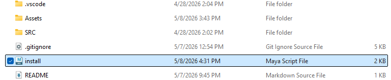

# Maya Animation Tool
--------------------------------------------

## Tech Stack

| Tool | Version| 
|------|------|
| Python | 3.12 |
| PySide| 6| 
| Maya| >= 2025| 

----

## Auto OverLapper

A tool that can help with overlapping in animation when it comes too fingers and or hair

---

## How To Install

 - Drag install file into Maya workspace
 - Then find it on your Maya shelf

## Usage
  - Install plugin to Maya 
  - Open the new shelf icon
  - Select the controller you want to make the base For the overlap